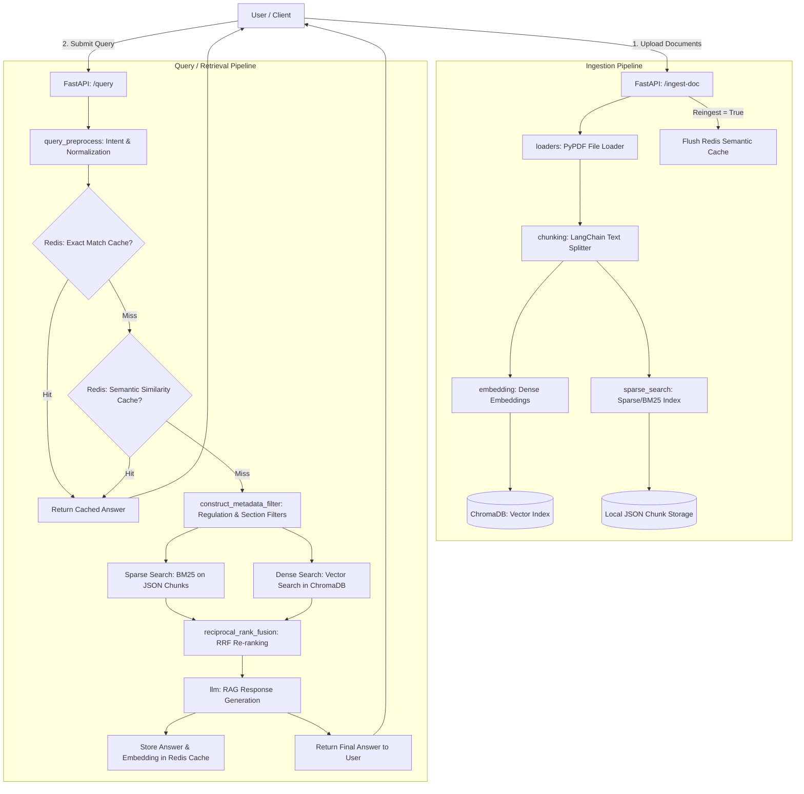

# Regularity Compliance Engine

The **Regularity Compliance Engine** is a Retrieval-Augmented Generation (RAG) platform that functions as an intelligent "bridge" between an organization’s internal operations and the strict requirements of international security, compliance, and privacy frameworks.

It allows organizations to ingest complex regulatory documentation (such as policies, regulations, and standards), parse and index them, and run semantically-aware queries to verify compliance, extract answers, and retrieve precise regulatory citations.

---

## Architecture & Workflow

The engine utilizes a hybrid retrieval approach combining **Sparse Search** (keyword/lexical matching) and **Dense Search** (semantic/vector matching) powered by a semantic caching layer to deliver highly accurate, fast, and contextual compliance recommendations.

### System Workflow Diagram



---

## How It Works

### 1. Document Ingestion
* **Loading & Parsing**: The ingestion pipeline accepts document uploads via the `/ingest-doc` API, extracting text using PDF loaders.
* **Text Chunking**: LangChain Text Splitters divide the raw text into logical, structured chunks optimized for search retrieval.
* **Vector Indexing (Dense)**: The system computes vector embeddings for each chunk and indexes them inside **ChromaDB**.
* **Lexical Indexing (Sparse)**: Chunks are tokenized and saved into a structured local JSON file to serve BM25 lexical keyword matching.
* **Cache Management**: A full re-ingestion invalidates the Redis semantic cache to prevent stale answers.

### 2. Intelligent Hybrid Retrieval & RAG
* **Query Preprocessing**: Queries are cleaned, normalized, and evaluated for user intent.
* **Two-Tier Caching**:
  1. **Exact Caching**: Quickly matches exact queries in Redis.
  2. **Semantic Caching**: Checks Redis vector search for semantically equivalent queries previously answered.
* **Hybrid Search**: If there is a cache miss, the engine triggers two parallel search pipelines:
  * **Sparse Search (BM25)** for exact keyword and structural matches.
  * **Dense Search (Vector)** for semantic meaning and conceptual matching.
* **Reciprocal Rank Fusion (RRF)**: Merges candidate documents from both search methodologies, scoring and re-ranking them to generate the most relevant context.
* **Response Generation**: The LLM synthesizes the user query and RRF-refined context to output a comprehensive answer detailing compliance guidance and exact citations.

---

## Tech Stack

* **Backend Framework**: [FastAPI](https://fastapi.tiangolo.com/) & [Uvicorn](https://www.uvicorn.org/)
* **Vector Database**: [ChromaDB](https://www.trychroma.com/)
* **Caching & Semantic Cache**: [Redis](https://redis.io/) (via `redis.asyncio`)
* **Embeddings**: [FastEmbed](https://qdrant.github.io/fastembed/) & [LangChain HuggingFace](https://github.com/langchain-ai/langchain)
* **Keyword Search**: [Rank-BM25](https://github.com/dorianbrown/rank_bm25)
* **Text Processing**: [LangChain Text Splitters](https://github.com/langchain-ai/langchain), [NLTK](https://www.nltk.org/), & [PyAhoCorasick](https://github.com/WojciechMula/pyahocorasick)
* **Document Parsing**: [PyPDF](https://pypdf.readthedocs.io/)
* **Language & Runtime**: Python 3.10+

---

## Setup & Installation

Follow these steps to pull the repository and run the engine locally:

### 1. Clone the Repository
```bash
git clone https://github.com/Dreamervamsi/Regularity-Compliance-Engine.git
cd Regularity-Compliance-Engine
```

### 2. Set Up a Virtual Environment
```powershell
# Create virtual environment
python -m venv .venv

# Activate virtual environment
# On Windows (PowerShell):
.venv\Scripts\Activate.ps1
# On macOS/Linux:
source .venv/bin/activate
```

### 3. Install Dependencies
```bash
pip install -r requirements.txt
```

### 4. Configure Environment Variables
Create a `.env` file in the root directory (you can copy `.env.example` as a template):
```bash
cp .env.example .env
```
Ensure your configuration keys (such as API keys and Redis connection details) are filled in `.env`.

### 5. Launch the Application
Start the FastAPI server using Uvicorn:
```bash
python main.py
```
By default, the server runs on `http://127.0.0.1:8000`. You can access the interactive API docs at `http://127.0.0.1:8000/docs`.

