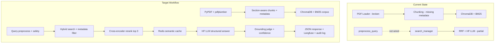
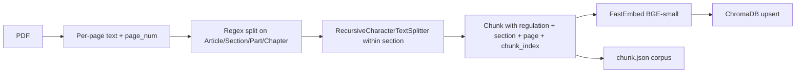
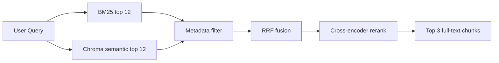

# Regulatory Compliance Engine — Full Workflow Plan

## Current State vs Target

Your codebase already has the **right module layout** for most of the workflow, but it is not end-to-end functional. Several bugs block ingestion, imports are broken, and `/query` never reaches retrieval or the LLM.




| Workflow Step                        | Status Today                                   | Key Files                                                                                                                                 |
| ------------------------------------ | ---------------------------------------------- | ----------------------------------------------------------------------------------------------------------------------------------------- |
| PDF parsing (PyPDF)                  | Broken (`'text'` literal bug, regex tuple bug) | `[ingest_docs/loaders.py](ingest_docs/loaders.py)`                                                                                        |
| pdfplumber                           | Missing                                        | —                                                                                                                                         |
| Section-aware chunking               | Partial (section title lost in chunks)         | `[ingest_docs/loaders.py](ingest_docs/loaders.py)`, `[ingest_docs/chunking.py](ingest_docs/chunking.py)`                                  |
| Metadata (regulation, section, page) | Mostly missing                                 | `[ingest_docs/chunking.py](ingest_docs/chunking.py)`                                                                                      |
| Storage                              | ChromaDB + `chunk.json` (keep as-is)           | `[index_dense.py](rag_pipeline/dual_search/dense_search/src/index_dense.py)`                                                              |
| BM25 + semantic + RRF                | Implemented, not wired to API                  | `[sparse_index.py](rag_pipeline/dual_search/sparse_search/src/sparse_index.py)`, `[rrf_ranking.py](rag_pipeline/retrieve/rrf_ranking.py)` |
| Metadata filtering                   | Missing                                        | —                                                                                                                                         |
| Cross-encoder rerank                 | Missing (RRF only)                             | —                                                                                                                                         |
| Redis semantic cache                 | Missing (`lru_cache` only, broken key)         | `[rag_pipeline/rag/llm.py](rag_pipeline/rag/llm.py)`                                                                                      |
| HF LLM + structured output           | Partial (free-text only)                       | `[rag_pipeline/rag/llm.py](rag_pipeline/rag/llm.py)`                                                                                      |
| Confidence score                     | Missing                                        | —                                                                                                                                         |
| Safety (injection filter)            | Partial (keyword blocklist works)              | `[intent_query.py](rag_pipeline/query_preprocess/intent_query.py)`                                                                        |
| Grounding check                      | Missing                                        | —                                                                                                                                         |
| RAGAS eval                           | Missing                                        | —                                                                                                                                         |
| Langfuse + audit log                 | Missing                                        | —                                                                                                                                         |
| API wiring                           | Broken (`/query` returns nothing)              | `[main.py](main.py)`                                                                                                                      |


**Your decisions applied:** ChromaDB replaces PostgreSQL; HuggingFace Llama-3 stays as the LLM (structured JSON output added on top).

---

## Phase 0 — Fix Critical Bugs (Unblock End-to-End)

Do this first so every later phase can be tested incrementally.

### 0.1 Fix broken imports

`[search_manager.py](rag_pipeline/retrieve/search_manager.py)` and `[ingest_manager.py](ingest_docs/ingest_manager.py)` import `rag_pipeline.dual_search.dense_search.src.index`, but the file is `[index_dense.py](rag_pipeline/dual_search/dense_search/src/index_dense.py)`. Either rename to `index.py` or update imports — pick one convention and apply everywhere.

### 0.2 Fix PDF loader bugs in `[loaders.py](ingest_docs/loaders.py)`

- Line 15: change `extracted_text += 'text'` → `extracted_text += text`
- Line 17: remove trailing comma on `pattern` (currently a tuple, breaks `re.split`)
- Add capturing group to regex so section titles are preserved:

```python
  pattern = r'(?m)^((?:Section|Article|Part|Chapter)\s+[\dIVXLC]+(?:\.\d+)*[.:]?\s*.+)$'
  parts = re.split(pattern, extracted_text)
  

```

- Assign `doc_id = str(uuid.uuid4())` per file and include it in each result dict

### 0.3 Fix chunk metadata in `[chunking.py](ingest_docs/chunking.py)`

- Use `res.get("doc_id", str(uuid.uuid4()))` instead of missing `res["id"]`
- Propagate `section_title`, `regulation` (from filename), and `page` into chunk metadata
- Align key names: use `chunk_index` consistently (fix `[llm.py](rag_pipeline/rag/llm.py)` line 55 which reads `chunk_idx`)

### 0.4 Fix preprocess dict access in `[preprocess.py](rag_pipeline/query_preprocess/preprocess.py)`

- Change `res.detected` → `res['detected']` (returns dict, not object)
- Return the normalised query on success so downstream retrieval can use it

### 0.5 Fix LLM cache key in `[llm.py](rag_pipeline/rag/llm.py)`

- Change `json.dump(...)` → `json.dumps(..., sort_keys=True, default=str)`

### 0.6 Wire `/query` in `[main.py](main.py)`

```python
@app.post('/query')
def query(query: str):
    preprocessed = preprocess_query(query)
    if preprocessed and preprocessed.get('detected'):
        return JSONResponse(status_code=403, content=preprocessed)
    result = search(preprocessed or query)
    return result
```

### 0.7 Update `[requirements.txt](requirements.txt)`

Add missing runtime deps: `fastapi`, `uvicorn`. Pin versions for reproducibility.

**Exit criteria:** `POST /ingest-doc` + `POST /query` returns an answer with citations end-to-end.

---

## Phase 1 — Ingestion Pipeline (PDF + Section Metadata)

### 1.1 Dual PDF extraction (PyPDF + pdfplumber)

Extend `[loaders.py](ingest_docs/loaders.py)`:

- **PyPDF** (`pypdf`): fast full-text extraction per page
- **pdfplumber**: fallback for pages where PyPDF returns empty/garbled text; also extract tables as structured text blocks

Suggested flow per page:

```
page_text = pypdf_extract(page)
if len(page_text.strip()) < 50:
    page_text = pdfplumber_extract(page)  # layout-aware fallback
```

Add `pdfplumber` to `[requirements.txt](requirements.txt)`.

### 1.2 Section-aware chunking strategy

Current approach splits by regex then character-chunks inside sections — keep this two-stage pattern but fix metadata propagation:




**Metadata schema** (stored in ChromaDB + `chunk.json`):

```python
{
    "regulation": "GDPR.pdf",       # from filename or upload param
    "section": "Article 5",         # from regex header
    "page": 12,                     # page where section starts
    "source": "GDPR.pdf",
    "doc_id": "uuid",
    "chunk_index": 0
}
```

### 1.3 Ingest API enhancement

Extend `[main.py](main.py)` ingest endpoint to accept optional `regulation_name` per file (or derive from filename). Pass through to loader → chunker.

**Exit criteria:** Ingested chunks carry `regulation`, `section`, `page` metadata visible in ChromaDB and BM25 corpus.

---

## Phase 2 — Hybrid Retrieval + Metadata Filtering + Reranking

### 2.1 Expand retrieval pool before fusion

In `[search_manager.py](rag_pipeline/retrieve/search_manager.py)`, retrieve `top_k * 4` (e.g. 12) from each channel, then fuse down — gives reranker more candidates.

### 2.2 Metadata filtering (new module)

Create `[rag_pipeline/retrieve/metadata_filter.py](rag_pipeline/retrieve/metadata_filter.py)`:

- Parse optional filters from query or request body: `regulation`, `section`, `article`
- Apply post-retrieval filter on BM25 + dense results before RRF
- ChromaDB supports `where` clauses — use for dense path:

```python
  collection.query(..., where={"regulation": {"$eq": "GDPR"}})

```

- BM25 path: filter `org_chunks` list before scoring

Extend `/query` request model:

```python
class QueryRequest(BaseModel):
    query: str
    regulation: Optional[str] = None
    section: Optional[str] = None
```

### 2.3 Cross-encoder reranking (new module)

Create `[rag_pipeline/retrieve/reranker.py](rag_pipeline/retrieve/reranker.py)`:

- Model: `cross-encoder/ms-marco-MiniLM-L-6-v2` via `sentence-transformers` (add to requirements)
- Input: query + top RRF candidates (full chunk text)
- Output: top 3 by cross-encoder score, attached as `rerank_score`
- Pipeline: BM25 + dense → RRF top 12 → cross-encoder rerank → **top 3 with full text**




### 2.4 Semantic search note

Your workflow mentions `sentence-transformers`; the project uses **FastEmbed** (`BAAI/bge-small-en-v1.5`) in `[embedding.py](ingest_docs/embedding.py)`. Keep FastEmbed for ingestion/query embedding (already integrated) and use `sentence-transformers` only for the cross-encoder reranker — avoids re-embedding the entire corpus.

**Exit criteria:** Query returns exactly 3 reranked chunks with `regulation`, `section`, `page`, `rerank_score` in metadata.

---

## Phase 3 — Redis Semantic Cache

Replace in-process `lru_cache` with Redis-backed semantic caching.

### 3.1 New module: `[rag_pipeline/cache/semantic_cache.py](rag_pipeline/cache/semantic_cache.py)`

Two cache layers:


| Cache               | Key                                 | Value                    | TTL |
| ------------------- | ----------------------------------- | ------------------------ | --- |
| **Retrieval cache** | embedding hash of query             | top-3 chunk IDs + scores | 1h  |
| **Answer cache**    | embedding hash of query + chunk IDs | structured JSON answer   | 30m |


Use **cosine similarity threshold** (e.g. 0.92) on query embeddings to find near-duplicate queries — true semantic cache, not exact string match.

### 3.2 Redis setup

- Add `redis` to `[requirements.txt](requirements.txt)`
- Add to `[config.py](config.py)`: `REDIS_URL`, `CACHE_SIMILARITY_THRESHOLD`, `CACHE_TTL_SECONDS`
- Invalidate retrieval cache on re-ingest (flush keys matching `retrieval:`*)

### 3.3 Integration point

Wrap `[search_manager.search()](rag_pipeline/retrieve/search_manager.py)`:

```
check cache → hit: return cached answer
miss: retrieve → rerank → generate → store in cache → return
```

**Exit criteria:** Repeated semantically similar queries return cached responses; cache invalidates on re-ingest.

---

## Phase 4 — Grounded LLM Generation (HuggingFace + Structured Output)

### 4.1 Structured response schema

Create `[rag_pipeline/rag/schemas.py](rag_pipeline/rag/schemas.py)`:

```python
class Source(BaseModel):
    regulation: str
    section: str
    page: int
    chunk_index: int

class ComplianceAnswer(BaseModel):
    answer: str
    sources: list[Source]
    confidence: int  # 0-100
    refused: bool    # True if confidence < threshold or insufficient context
```

### 4.2 Prompt template in `[llm.py](rag_pipeline/rag/llm.py)`

Replace free-text prompt with strict grounding template:

```
System: You answer ONLY from the regulations below. Cite regulation and article/section.
        If the answer is not in the context, set refused=true and confidence=0.

Context: [top 3 chunks with regulation, section, page]

Question: {query}

Respond in JSON matching this schema: {schema}
```

Use HuggingFace structured output via JSON mode or a two-pass approach (generate → parse with Pydantic validation → retry on parse failure).

### 4.3 Confidence scoring

Two signals combined:

- **Retrieval signal**: average `rerank_score` of top 3 chunks (normalized 0–100)
- **LLM self-assessment**: model assigns confidence in structured output
- Final confidence = weighted average; if `< 40` → set `refused: true`, answer = `"Insufficient information in retrieved regulations."`

### 4.4 Citation validation

Post-process: verify each `source.section` appears in the retrieved chunk metadata — reject hallucinated citations before returning.

**Exit criteria:** `/query` returns validated JSON: `{answer, sources[{reg, section, page}], confidence, refused}`.

---

## Phase 5 — Safety Layer (Production Guardrails)

### 5.1 Input sanitization (extend existing)

`[intent_query.py](rag_pipeline/query_preprocess/intent_query.py)` already has Aho-Corasick blocklist + SQL/XSS regex. Extend:

- Fix and complete `**safety_vector_scan()`** (currently empty stub at line 65):
  - Embed query with FastEmbed
  - Query `SAFETY_BLOCKLIST_COLLECTION` in ChromaDB
  - Block if distance < threshold (prompt injection examples)
- Add LLM injection check (lightweight): small HF call classifying query as `safe | injection | off_topic`
- Return structured block response with `category` and `blocked: true`

### 5.2 Grounding check (LLM-as-judge)

Create `[rag_pipeline/safety/grounding_check.py](rag_pipeline/safety/grounding_check.py)`:

```
Given retrieved text and generated answer, is every claim supported?
Respond: {grounded: bool, unsupported_claims: [...]}
```

If `grounded == false` → override answer with refusal, log flag.

### 5.3 Output safety filter

Before returning JSON, scan answer for:

- PII patterns (emails, SSN-like numbers)
- Blocklisted content not present in source chunks

**Exit criteria:** Injection queries blocked at input; ungrounded answers refused at output.

---

## Phase 6 — Observability, Evaluation, Audit

### 6.1 Langfuse integration

Create `[rag_pipeline/observability/langfuse_tracer.py](rag_pipeline/observability/langfuse_tracer.py)`:

- Trace each `/query` as a Langfuse trace with spans:
  - `preprocess` → `retrieve_bm25` → `retrieve_dense` → `rrf` → `rerank` → `llm_generate` → `grounding_check`
- Log: query, retrieved chunk IDs, answer, confidence, safety flags, latency
- Add `langfuse` to requirements; config: `LANGFUSE_PUBLIC_KEY`, `LANGFUSE_SECRET_KEY`

### 6.2 RAGAS evaluation

Create `[rag_pipeline/eval/ragas_eval.py](rag_pipeline/eval/ragas_eval.py)`:

- Metrics: **faithfulness**, **context precision**, **answer relevancy**
- Run offline against a golden Q&A dataset (create `eval/golden_set.json` with ~20 regulation questions + expected sections)
- CLI command: `python -m rag_pipeline.eval.ragas_eval --dataset eval/golden_set.json`
- Add `ragas` to requirements

### 6.3 Audit log (file-based, no PostgreSQL)

Create `[rag_pipeline/observability/audit_log.py](rag_pipeline/observability/audit_log.py)`:

Log each query to JSONL file (`logs/audit.jsonl`):

```json
{
  "timestamp": "...",
  "query": "...",
  "retrieved_chunks": [...],
  "answer": "...",
  "confidence": 85,
  "safety_flags": [],
  "grounding_passed": true,
  "cache_hit": false,
  "latency_ms": 1234
}
```

**Exit criteria:** Langfuse dashboard shows traces; RAGAS eval runs on golden set; audit log captures every query.

---

## Phase 7 — Final API Contract

### 7.1 Structured `/query` response

Update `[main.py](main.py)` with Pydantic models:

```python
@app.post('/query', response_model=ComplianceResponse)
def query(req: QueryRequest):
    # full pipeline
    return ComplianceResponse(
        answer=...,
        sources=[...],
        confidence=...,
        refused=...,
        cache_hit=...,
        trace_id=...  # Langfuse trace ID
    )
```

### 7.2 Suggested final directory structure

```
rag_pipeline/
├── cache/
│   └── semantic_cache.py          # NEW
├── eval/
│   └── ragas_eval.py              # NEW
├── observability/
│   ├── langfuse_tracer.py         # NEW
│   └── audit_log.py               # NEW
├── retrieve/
│   ├── metadata_filter.py         # NEW
│   └── reranker.py                # NEW
├── safety/
│   └── grounding_check.py         # NEW
└── rag/
    └── schemas.py                 # NEW
```

---

## Recommended Implementation Order

```mermaid
gantt
    title Implementation Phases
    dateFormat X
    axisFormat %s

    section Foundation
    Phase0_BugFixes           :0, 1
    Phase1_Ingestion          :1, 2

    section Retrieval
    Phase2_HybridRerank       :2, 4

    section Production
    Phase3_RedisCache         :4, 5
    Phase4_StructuredLLM      :5, 6
    Phase5_Safety             :6, 7
    Phase6_Observability      :7, 8
    Phase7_APIContract        :8, 9
```




| Phase                        | Effort   | Depends On |
| ---------------------------- | -------- | ---------- |
| 0 — Bug fixes                | 1–2 days | —          |
| 1 — Ingestion                | 2–3 days | Phase 0    |
| 2 — Retrieval + rerank       | 2–3 days | Phase 1    |
| 3 — Redis cache              | 1–2 days | Phase 2    |
| 4 — Structured LLM           | 2 days   | Phase 2    |
| 5 — Safety                   | 2–3 days | Phase 4    |
| 6 — Langfuse + RAGAS + audit | 2 days   | Phase 4    |
| 7 — API contract             | 1 day    | All above  |


**Total estimate: ~2–3 weeks** for a single developer working through phases sequentially.

---

## Environment Variables Needed

Add to `.env.example`:

```
HF_TOKEN=...
REDIS_URL=redis://localhost:6379
LANGFUSE_PUBLIC_KEY=...
LANGFUSE_SECRET_KEY=...
LANGFUSE_HOST=https://cloud.langfuse.com
CONFIDENCE_THRESHOLD=40
CACHE_SIMILARITY_THRESHOLD=0.92
```

---

## Key Risks and Mitigations


| Risk                                         | Mitigation                                                                                      |
| -------------------------------------------- | ----------------------------------------------------------------------------------------------- |
| HF Llama-3 JSON output unreliable            | Two-pass: generate answer → separate structured extraction call; Pydantic validation with retry |
| Section regex misses non-standard headers    | Add configurable header patterns per regulation type; pdfplumber table extraction as fallback   |
| Cross-encoder latency                        | Cache reranked results in Redis; batch score all candidates in one call                         |
| FastEmbed vs sentence-transformers confusion | FastEmbed for embeddings only; sentence-transformers for cross-encoder reranker only            |
| Re-ingest stale cache                        | Flush Redis keys on ingest; version collection name with timestamp                              |


